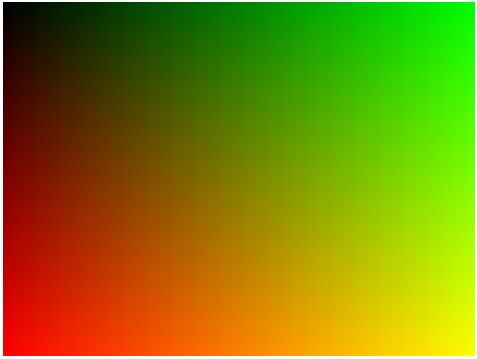
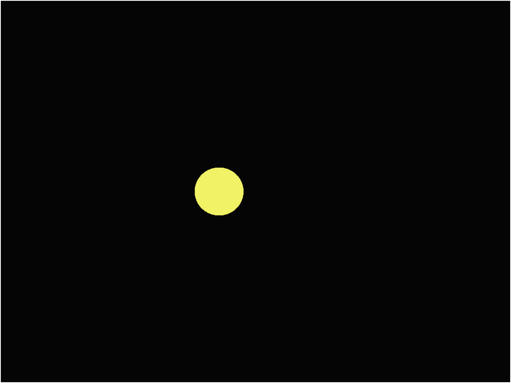
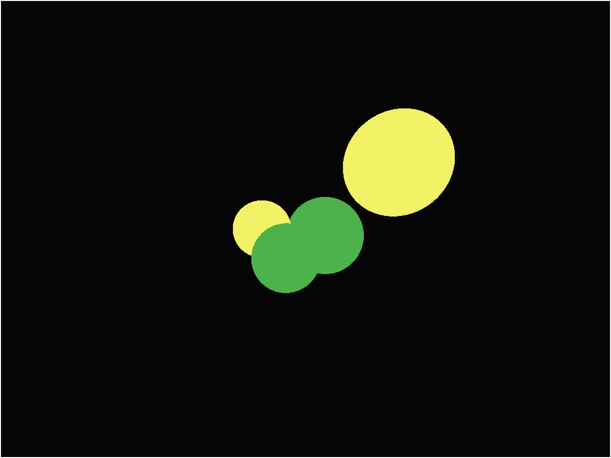
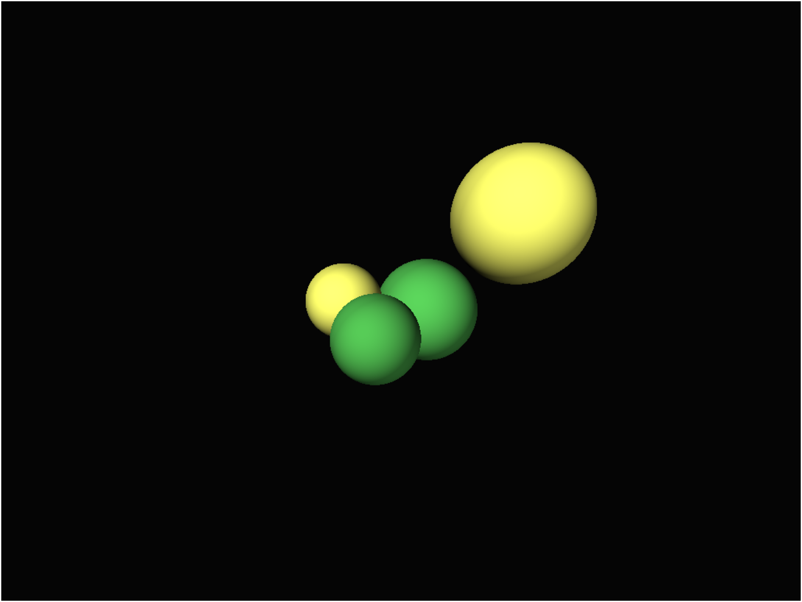
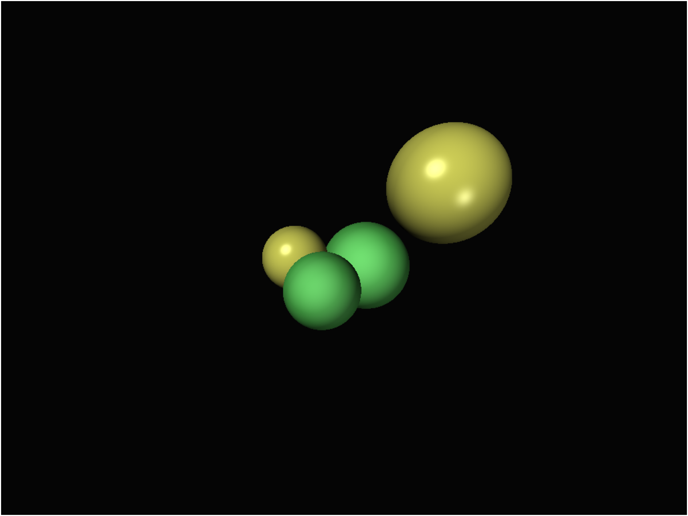

# Ray tracing in Mojo

This tutorial about [ray tracing](https://en.wikipedia.org/wiki/Ray_tracing_(graphics)) is based on the popular tutorial [Understandable RayTracing in C++](https://github.com/ssloy/tinyraytracer/wiki/Part-1:-understandable-raytracing). The mathematical explanations are well described in that tutorial, so we'll just point you to the appropriate sections for reference as we implement a basic ray tracer in Mojo.

## Step 1: Basic definitions

We'll start by defining a `Vec3f` struct, which will use to represent a vector in 3D space as well as RGB pixels. We'll use a `SIMD` representation for our vector to enable vectorized operations. Note that since the SIMD type only allows a power of 2, we always pad the underlying storage with a 0.


```mojo
from Math import rsqrt
from DType import DType


@register_passable("trivial")
struct Vec3f:
    var data: SIMD[DType.float32, 4]

    @always_inline
    fn __init__(x: Float32, y: Float32, z: Float32) -> Self:
        return Vec3f {data: SIMD[DType.float32, 4](x, y, z, 0)}

    @always_inline
    fn __init__(data: SIMD[DType.float32, 4]) -> Self:
        return Vec3f {data: data}

    @always_inline
    @staticmethod
    fn zero() -> Vec3f:
        return Vec3f(0, 0, 0)

    @always_inline
    fn __sub__(self, other: Vec3f) -> Vec3f:
        return self.data - other.data

    @always_inline
    fn __add__(self, other: Vec3f) -> Vec3f:
        return self.data + other.data

    @always_inline
    fn __matmul__(self, other: Vec3f) -> Float32:
        return (self.data * other.data).reduce_add()

    @always_inline
    fn __mul__(self, k: Float32) -> Vec3f:
        return self.data * k

    @always_inline
    fn __neg__(self) -> Vec3f:
        return self.data * -1.0

    @always_inline
    fn __getitem__(self, idx: Int) -> SIMD[DType.float32, 1]:
        return self.data[idx]

    @always_inline
    fn cross(self, other: Vec3f) -> Vec3f:
        let self_zxy = self.data.shuffle[2, 0, 1, 3]()
        let other_zxy = other.data.shuffle[2, 0, 1, 3]()
        return (self_zxy * other.data - self.data * other_zxy).shuffle[
            2, 0, 1, 3
        ]()

    @always_inline
    fn normalize(self) -> Vec3f:
        return self.data * rsqrt(self @ self)
```

We now define our `Image` struct, which will store the RGB pixels of our images. It also contains a method to conver this Mojo struct into a numpy image, which will be used for implementing a straightforward displaying mechanism. We will also implement a function for loading PNG files from disk.


```mojo
from String import String

struct Image:
    # reference count used to make the object efficiently copyable
    var rc: Pointer[Int]
    # the two dimensional image is represented as a flat array
    var pixels: Pointer[Vec3f]
    var height: Int
    var width: Int

    fn __init__(inout self, height: Int, width: Int):
        self.height = height
        self.width = width
        self.pixels = Pointer[Vec3f].alloc(self.height * self.width)
        self.rc = Pointer[Int].alloc(1)
        self.rc.store(1)

    fn __copyinit__(inout self, other: Self):
        other._inc_rc()
        self.pixels = other.pixels
        self.rc = other.rc
        self.height = other.height
        self.width = other.width

    fn __del__(owned self):
        self._dec_rc()

    fn _get_rc(self) -> Int:
        return self.rc.load()

    fn _dec_rc(self):
        let rc = self._get_rc()
        if rc > 1:
            self.rc.store(rc - 1)
            return
        self._free()

    fn _inc_rc(self):
        let rc = self._get_rc()
        self.rc.store(rc + 1)

    fn _free(self):
        self.rc.free()
        self.pixels.free()

    @always_inline
    fn set(self, row: Int, col: Int, value: Vec3f) -> None:
        self.pixels.store(self._pos_to_index(row, col), value)

    @always_inline
    fn _pos_to_index(self, row: Int, col: Int) -> Int:
        # Convert a (rol, col) position into an index in the underlying linear storage
        return row * self.width + col

    def to_numpy_image(self) -> PythonObject:
        let np = Python.import_module("numpy")
        let plt = Python.import_module("matplotlib.pyplot")

        let np_image = np.zeros((self.height, self.width, 3), np.float32)

        # We use raw pointers to efficiently copy the pixels to the numpy array
        let out_pointer = Pointer(
            __mlir_op.`pop.index_to_pointer`[
                _type : __mlir_type.`!pop.pointer<scalar<f32>>>`
            ](
                SIMD[DType.index, 1](
                    np_image.__array_interface__["data"][0].__index__()
                ).value
            )
        )
        let in_pointer = Pointer(
            __mlir_op.`pop.index_to_pointer`[
                _type : __mlir_type.`!pop.pointer<scalar<f32>>>`
            ](SIMD[DType.index, 1](self.pixels.__as_index()).value)
        )

        for row in range(self.height):
            for col in range(self.width):
                let index = self._pos_to_index(row, col)
                for dim in range(3):
                    out_pointer.store(
                        index * 3 + dim, in_pointer[index * 4 + dim]
                    )

        return np_image


def load_image(fname: String) -> Image:
    let np = Python.import_module("numpy")
    let plt = Python.import_module("matplotlib.pyplot")

    let np_image = plt.imread(fname)
    let rows = np_image.shape[0].__index__()
    let cols = np_image.shape[1].__index__()
    let image = Image(rows, cols)

    let in_pointer = Pointer(
        __mlir_op.`pop.index_to_pointer`[
            _type : __mlir_type.`!pop.pointer<scalar<f32>>>`
        ](
            SIMD[DType.index, 1](
                np_image.__array_interface__["data"][0].__index__()
            ).value
        )
    )
    let out_pointer = Pointer(
        __mlir_op.`pop.index_to_pointer`[
            _type : __mlir_type.`!pop.pointer<scalar<f32>>>`
        ](SIMD[DType.index, 1](image.pixels.__as_index()).value)
    )
    for row in range(rows):
        for col in range(cols):
            let index = image._pos_to_index(row, col)
            for dim in range(3):
                out_pointer.store(
                    index * 4 + dim, in_pointer[index * 3 + dim]
                )
    return image

```

We then add a function for quickly displaying an `Image` into the notebook. Our Python interopt comes in quite handy.


```mojo
def render(image: Image):
    np = Python.import_module("numpy")
    plt = Python.import_module("matplotlib.pyplot")
    colors = Python.import_module("matplotlib.colors")
    dpi = 32
    fig = plt.figure(1, [image.height // 10, image.width // 10], dpi)

    plt.imshow(image.to_numpy_image())
    plt.axis("off")
    plt.show()
```

Finally, we test all our code so far with a simple image, which is the one rendered in the [Step 1 of the C++ tutorial](https://github.com/ssloy/tinyraytracer/wiki/Part-1:-understandable-raytracing#step-1-write-an-image-to-the-disk).


```mojo
let image = Image(192, 256)

for row in range(image.height):
    for col in range(image.width):
        image.set(
            row,
            col,
            Vec3f(Float32(row) / image.height, Float32(col) / image.width, 0),
        )

render(image)
```


    

    


    


## Step 2: Ray tracing

Now we'll perform ray tracing from a camera into a scene with a sphere. Before reading the code below, we suggest you read more about how this works conceptually from [Step 2 of the C++ tutorial](https://github.com/ssloy/tinyraytracer/wiki/Part-1:-understandable-raytracing#step-2-the-crucial-one-ray-tracing).

We first define the `Material` and `Sphere` structs, which are the new data structures we'll need.


```mojo
from Math import sqrt


@register_passable("trivial")
struct Material:
    var color: Vec3f
    var albedo: Vec3f
    var specular_component: Float32

    fn __init__(color: Vec3f) -> Material:
        return Material {
            color: color, albedo: Vec3f(0, 0, 0), specular_component: 0
        }

    fn __init__(
        color: Vec3f, albedo: Vec3f, specular_component: Float32
    ) -> Material:
        return Material {
            color: color, albedo: albedo, specular_component: specular_component
        }


alias W = 1024
alias H = 768
alias bg_color = Vec3f(0.02, 0.02, 0.02)
let shiny_yellow = Material(Vec3f(0.95, 0.95, 0.4), Vec3f(0.7, 0.6, 0), 30.0)
let green_rubber = Material(Vec3f( 0.3,  0.7, 0.3), Vec3f(0.9, 0.1, 0), 1.0)


@register_passable("trivial")
struct Sphere:
    var center: Vec3f
    var radius: Float32
    var material: Material

    fn __init__(c: Vec3f, r: Float32, material: Material) -> Self:
        return Sphere {center: c, radius: r, material: material}

    @always_inline
    fn intersects(self, orig: Vec3f, dir: Vec3f, inout dist: Float32) -> Bool:
        """This method returns True if a given ray intersects this sphere.
        And if it does, it writes in the `dist` parameter the distance to the
        origin of the ray.
        """
        let L = orig - self.center
        let a = dir @ dir
        let b = 2 * (dir @ L)
        let c = L @ L - self.radius * self.radius
        let discriminant = b * b - 4 * a * c
        if discriminant < 0:
            return False
        if discriminant == 0:
            dist = -b / 2 * a
            return True
        let q = -0.5 * (b + sqrt(discriminant)) if b > 0 else -0.5 * (
            b - sqrt(discriminant)
        )
        var t0 = q / a
        let t1 = c / q
        if t0 > t1:
            t0 = t1
        if t0 < 0:
            t0 = t1
            if t0 < 0:
                return False

        dist = t0
        return True
```

We then define a `cast_ray` method, which will be used to figure out the color of a particular pixel in the image we'll produce. It basically works by identifying whether this ray intersects the sphere or not.


```mojo
fn cast_ray(orig: Vec3f, dir: Vec3f, sphere: Sphere) -> Vec3f:
    var dist: Float32 = 0
    if not sphere.intersects(orig, dir, dist):
        return bg_color

    return sphere.material.color
```

Lastly, we parallelize the ray tracing for every pixel row-wise.


```mojo
from Math import tan, acos
from Functional import parallelize


fn create_image_with_sphere(sphere: Sphere, height: Int, width: Int) -> Image:
    let image = Image(height, width)

    @parameter
    fn _process_row(row: Int):
        let y = -((2.0 * row + 1) / height - 1)
        for col in range(width):
            let x = ((2.0 * col + 1) / width - 1) * width / height
            let dir = Vec3f(x, y, -1).normalize()
            image.set(row, col, cast_ray(Vec3f.zero(), dir, sphere))

    parallelize[_process_row](height)

    return image


render(
    create_image_with_sphere(Sphere(Vec3f(-3, 0, -16), 2, shiny_yellow), H, W)
)
```


    

    


    


## Step 3: More spheres

This section corresponds to the [Step 3 of the C++ tutorial](https://github.com/ssloy/tinyraytracer/wiki/Part-1:-understandable-raytracing#step-3-add-more-spheres). 

We include here all the necessary changes:

- We add 3 more spheres to the scene, 2 of them being of ivory material.
- When we intersect the ray with the sphere, we render the color of the closest sphere.


```mojo
from Functional import parallelize
from Vector import DynamicVector
from Limits import inf


fn scene_intersect(
    orig: Vec3f,
    dir: Vec3f,
    spheres: DynamicVector[Sphere],
    background: Material,
) -> Material:
    var spheres_dist = inf[DType.float32]()
    var material = background

    for i in range(0, spheres.size):
        var dist = inf[DType.float32]()
        if spheres[i].intersects(orig, dir, dist) and dist < spheres_dist:
            spheres_dist = dist
            material = spheres[i].material

    return material


fn cast_ray(
    orig: Vec3f, dir: Vec3f, spheres: DynamicVector[Sphere]
) -> Material:
    let background = Material(Vec3f(0.02, 0.02, 0.02))
    return scene_intersect(orig, dir, spheres, background)


fn create_image_with_spheres(
    spheres: DynamicVector[Sphere], height: Int, width: Int
) -> Image:
    let image = Image(height, width)

    @parameter
    fn _process_row(row: Int):
        let y = -((2.0 * row + 1) / height - 1)
        for col in range(width):
            let x = ((2.0 * col + 1) / width - 1) * width / height
            let dir = Vec3f(x, y, -1).normalize()
            image.set(row, col, cast_ray(Vec3f.zero(), dir, spheres).color)

    parallelize[_process_row](height)

    return image
  
let spheres = DynamicVector[Sphere]()
spheres.push_back(Sphere(Vec3f(-3,      0, -16),   2, shiny_yellow))
spheres.push_back(Sphere(Vec3f(-1.0, -1.5, -12), 1.8, green_rubber))
spheres.push_back(Sphere(Vec3f( 1.5, -0.5, -18),   3, green_rubber))
spheres.push_back(Sphere(Vec3f( 7,      5, -18),   4, shiny_yellow))

render(create_image_with_spheres(spheres, H, W))
```


    

    


    


## Step 4: Add lighting

This section corresponds to the [Step 4 of the C++ tutorial](https://github.com/ssloy/tinyraytracer/wiki/Part-1:-understandable-raytracing#step-4-lighting). Please read that section for an explanation of the trick used to estimate the light intensity of pixel based on the angle of intersection between each ray and the spheres. The changes are minimal and are primarily about handling this intersection angle.


```mojo
@register_passable("trivial")
struct Light:
    var position: Vec3f
    var intensity: Float32

    fn __init__(p: Vec3f, i: Float32) -> Self:
        return Light {position: p, intensity: i}
```


```mojo
from Math import max


fn scene_intersect(
    orig: Vec3f,
    dir: Vec3f,
    spheres: DynamicVector[Sphere],
    inout material: Material,
    inout hit: Vec3f,
    inout N: Vec3f,
) -> Bool:
    var spheres_dist = inf[DType.float32]()

    for i in range(0, spheres.size):
        var dist: Float32 = 0
        if spheres[i].intersects(orig, dir, dist) and dist < spheres_dist:
            spheres_dist = dist
            hit = orig + dir * dist
            N = (hit - spheres[i].center).normalize()
            material = spheres[i].material

    return (spheres_dist != inf[DType.float32]()).__bool__()


fn cast_ray(
    orig: Vec3f,
    dir: Vec3f,
    spheres: DynamicVector[Sphere],
    lights: DynamicVector[Light],
) -> Material:
    var point = Vec3f.zero()
    var material = Material(Vec3f.zero())
    var N = Vec3f.zero()
    if not scene_intersect(orig, dir, spheres, material, point, N):
        return bg_color

    var diffuse_light_intensity: Float32 = 0
    for i in range(lights.size):
        let light_dir = (lights[i].position - point).normalize()
        diffuse_light_intensity += lights[i].intensity * max(0, light_dir @ N)

    return material.color * diffuse_light_intensity


fn create_image_with_spheres_and_lights(
    spheres: DynamicVector[Sphere],
    lights: DynamicVector[Light],
    height: Int,
    width: Int,
) -> Image:
    let image = Image(height, width)

    @parameter
    fn _process_row(row: Int):
        let y = -((2.0 * row + 1) / height - 1)
        for col in range(width):
            let x = ((2.0 * col + 1) / width - 1) * width / height
            let dir = Vec3f(x, y, -1).normalize()
            image.set(
                row, col, cast_ray(Vec3f.zero(), dir, spheres, lights).color
            )

    parallelize[_process_row](height)

    return image


let lights = DynamicVector[Light]()
lights.push_back(Light(Vec3f(-20, 20, 20), 1.0))
lights.push_back(Light(Vec3f(20, -20, 20), 0.5))

render(create_image_with_spheres_and_lights(spheres, lights, H, W))
```

    Clipping input data to the valid range for imshow with RGB data ([0..1] for floats or [0..255] for integers).


    

    


    


## Step 5: Add specular lighting

This section corresponds to the [Step 5 of the C++ tutorial](https://github.com/ssloy/tinyraytracer/wiki/Part-1:-understandable-raytracing#step-5-specular-lighting). The changes to the code are quite minimal, but the rendered picture looks much more realistic!


```mojo
from Math import pow


fn reflect(I: Vec3f, N: Vec3f) -> Vec3f:
    return I - N * (I @ N) * 2.0


fn cast_ray(
    orig: Vec3f,
    dir: Vec3f,
    spheres: DynamicVector[Sphere],
    lights: DynamicVector[Light],
) -> Material:
    var point = Vec3f.zero()
    var material = Material(Vec3f.zero())
    var N = Vec3f.zero()
    if not scene_intersect(orig, dir, spheres, material, point, N):
        return bg_color

    var diffuse_light_intensity: Float32 = 0
    var specular_light_intensity: Float32 = 0
    for i in range(lights.size):
        let light_dir = (lights[i].position - point).normalize()
        diffuse_light_intensity += lights[i].intensity * max(0, light_dir @ N)
        specular_light_intensity += (
            pow(
                max(0.0, -reflect(-light_dir, N) @ dir),
                material.specular_component,
            )
            * lights[i].intensity
        )

    let result = material.color * diffuse_light_intensity * material.albedo.data[
        0
    ] + Vec3f(
        1.0, 1.0, 1.0
    ) * specular_light_intensity * material.albedo.data[
        1
    ]
    let result_max = max(result[0], max(result[1], result[2]))
    # Cap the resulting vector
    if result_max > 1:
        return result * (1.0 / result_max)
    return result


fn create_image_with_spheres_and_specular_lights(
    spheres: DynamicVector[Sphere],
    lights: DynamicVector[Light],
    height: Int,
    width: Int,
) -> Image:
    let image = Image(height, width)

    @parameter
    fn _process_row(row: Int):
        let y = -((2.0 * row + 1) / height - 1)
        for col in range(width):
            let x = ((2.0 * col + 1) / width - 1) * width / height
            let dir = Vec3f(x, y, -1).normalize()
            image.set(
                row, col, cast_ray(Vec3f.zero(), dir, spheres, lights).color
            )

    parallelize[_process_row](height)

    return image


render(create_image_with_spheres_and_specular_lights(spheres, lights, H, W))
```


    

    


    


## Step 6: Add background

As a last step, let's use an image for the background instead of a uniform fill. The only code that we need to change is the code where we used to return `bg_color`. Now we will determine a point in the background image to which the ray is directed and draw that.


```mojo
from Math import abs


fn cast_ray(
    orig: Vec3f,
    dir: Vec3f,
    spheres: DynamicVector[Sphere],
    lights: DynamicVector[Light],
    bg: Image,
) -> Material:
    var point = Vec3f.zero()
    var material = Material(Vec3f.zero())
    var N = Vec3f.zero()
    if not scene_intersect(orig, dir, spheres, material, point, N):
        # Background
        # Given a direction vector `dir` we need to find a pixel in the image
        let x = dir[0]
        let y = dir[1]

        # Now map x from [-1,1] to [0,w-1] and do the same for y.
        let w = bg.width
        let h = bg.height
        let col = ((1.0 + x) * 0.5 * (w - 1)).to_int()
        let row = ((1.0 + y) * 0.5 * (h - 1)).to_int()
        return Material(bg.pixels[bg._pos_to_index(row, col)])

    var diffuse_light_intensity: Float32 = 0
    var specular_light_intensity: Float32 = 0
    for i in range(lights.size):
        let light_dir = (lights[i].position - point).normalize()
        diffuse_light_intensity += lights[i].intensity * max(0, light_dir @ N)
        specular_light_intensity += (
            pow(
                max(0.0, -reflect(-light_dir, N) @ dir),
                material.specular_component,
            )
            * lights[i].intensity
        )

    let result = material.color * diffuse_light_intensity * material.albedo.data[
        0
    ] + Vec3f(
        1.0, 1.0, 1.0
    ) * specular_light_intensity * material.albedo.data[
        1
    ]
    let result_max = max(result[0], max(result[1], result[2]))
    # Cap the resulting vector
    if result_max > 1:
        return result * (1.0 / result_max)
    return result


fn create_image_with_spheres_and_specular_lights(
    spheres: DynamicVector[Sphere],
    lights: DynamicVector[Light],
    height: Int,
    width: Int,
    bg: Image,
) -> Image:
    let image = Image(height, width)

    @parameter
    fn _process_row(row: Int):
        let y = -((2.0 * row + 1) / height - 1)
        for col in range(width):
            let x = ((2.0 * col + 1) / width - 1) * width / height
            let dir = Vec3f(x, y, -1).normalize()
            image.set(
                row, col, cast_ray(Vec3f.zero(), dir, spheres, lights, bg).color
            )

    parallelize[_process_row](height)

    return image


let bg = load_image("images/background.png")
render(
    create_image_with_spheres_and_specular_lights(spheres, lights, H, W, bg)
)
```


    

    


    


## Next steps

We've only explored the basics of ray tracing here, but you can add shadows, reflections and so much more! Fortunately these are explained in [the C++ tutorial](https://github.com/ssloy/tinyraytracer/wiki/Part-1:-understandable-raytracing), and we leave the corresponding Mojo implementations as an exercise for you.
